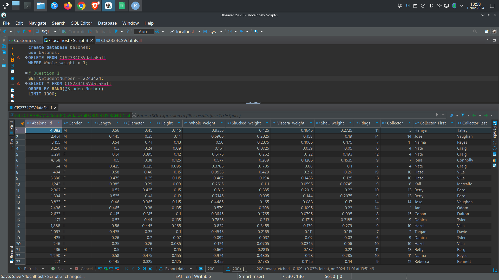

# 1. Get the required sample data from the database you created for your Semester Project 1. (10 points)

## A

## b. Export the results from this query and save the results as a “.csv” file using the name
“Firstname_Lastname_Personal_Data.csv”. This csv file will be the data you will use for
every task in this project. Note – The above query generates a unique data file for each
student. 

## c. Using Excel, save the “Firstname_Lastname_Personal_Data.csv” file as
“Firstname_Lastname_ExcData.xlsx” file.
Note – only the .xlsx file type allows you to perform various excel functions for the
rest of the tasks for this project.

## d. Name your current worksheet/tab “Personal Data”. 

# 2. Categorize the abalones. (10 points) 

The Marine Biologists discovered that certain abalones have some rare qualities. To further
investigate these rare qualities, the research team divided the abalone data into three
categories: Category I, Category II, and Category III. They believe that Category I and Category II
abalones have important research values. Category III abalones are normal abalones with
negligible research values. The following are the standards that this group of marine biologists
are using to categorize abalones. Each category contains several different rules.
At the top of your worksheet, you will display all the rows of data belonging to Category 1.
Then, you will next place all the rows of data belonging to Category 2. Finally, you will display all
the rows of data belonging to Category 3.

## a. If an abalone sample satisfies one of the following criteria, it belongs to Category I:
1) Ring \> 15 AND Infant.
2) Male AND Length \> 0.75.
3) (Shell weight \> 0.8 AND Shucked weight \> 0.5) OR (Shucked weight \> 1.2).

## b. If an abalone sample does not belong to Category I and satisfies one of the following
criteria, it belongs to Category II:
1) (Shell weight \< 0.4) AND (Shucked weight \< 0.4).
2) (Ring \> 15 AND Male) OR (RING \> 18 AND Female).
3) Length \< 0.36.

## c. If an abalone sample doesn’t belong to Category I or Category II, then the sample belongs to
Category III.
What you need to do:
1) Create a new worksheet in the “Firstname_Lastname_ExcData.xlsx” document.
2) Name your worksheet “Categorization”.
3) Copy the Personal Data into the “Categorization” worksheet/tab.
4) Implement the criteria defined above and separate the data into three Categories. For
each Category create a data table in the “Categorization” worksheet/tab

## 

# 3. Calculate the economic values of abalones. (10 points) 

The Marine Biologists are also interested in the economic value of the abalones and would like to
investigate several problems. First, they would like to know the values of every single abalone
that has been collected.
They have provided you with the current market standards used to estimate an abalone’s
monetary value:
Normal Abalone value = [1 + 1/3 (Length – 0.5) + 1/3 (Diameter– 0.4) + 1/3 (Height– 0.4)] \*
Whole_weight \* \$0.5.
a) In addition, If the abalone belongs to Category I, its value will be multiplied by 1.5.
b) If the abalone belongs to Category II, its value will be multiplied by 0.8.
c) If the abalone does not belong to Category 1 or Category 2, then the abalone belongs to
Category 3 which has a normal abalone value.
d) The Marine Biologists would like to know the average value for each gender.
e) Finally, they would like to know the average value for each water region.
What you need to do:
a. Create a new worksheet/tab in the “Firstname_Lastname_ExcData.xlsx”.
b. Name your worksheet “Economic Values”.
c. Compute the economic value for each abalone.
d. In the same worksheet, use another section of the worksheet to compute the average
abalone value for each gender; for each gender find the most expensive and the least
expensive abalone.
e. In the same worksheet, use another section of the worksheet to compute the average
abalone value for each water region; for each water region find the most expensive and
the least expensive abalone.
f. Design the worksheet using all the design tools that you have learned in module 1 and
module 2 of the textbook. For instance: add explanations and descriptions for each
table, add proper titles for each table, use different color scheme, apply proper cell
format and so on.

# 5. Create fast search functions for the data. (30 points)

# 6
